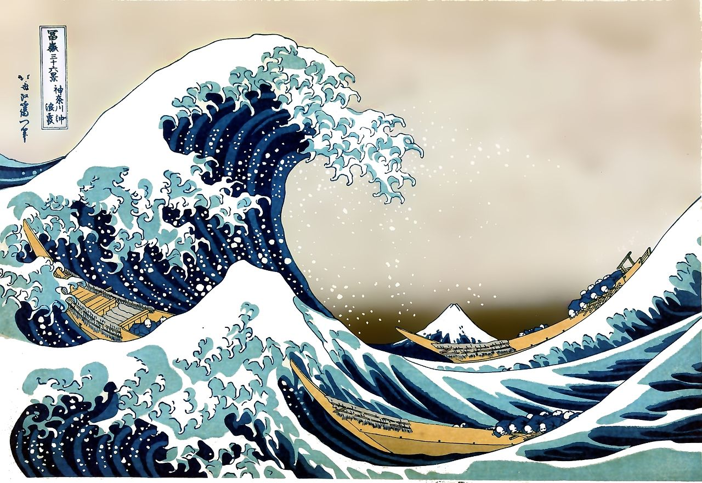
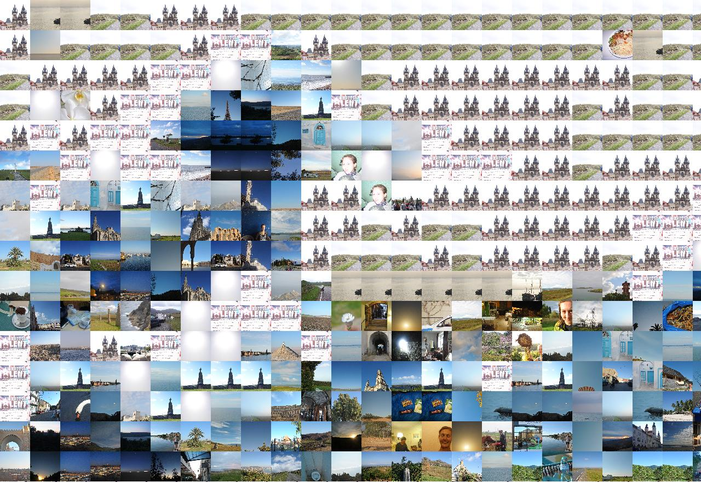
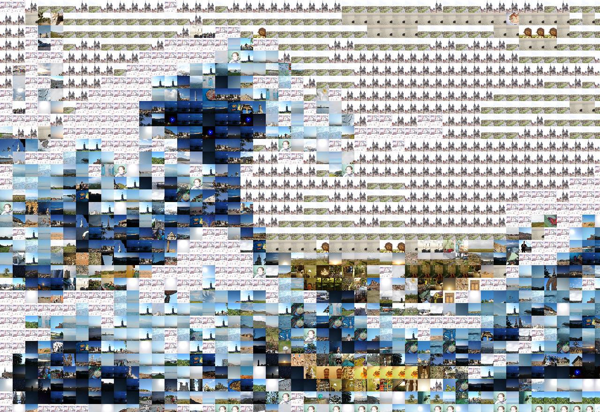
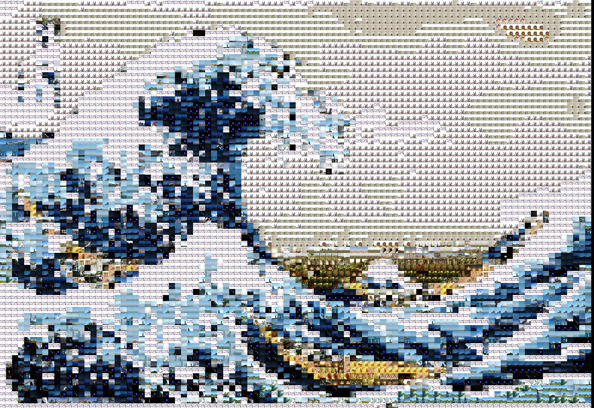
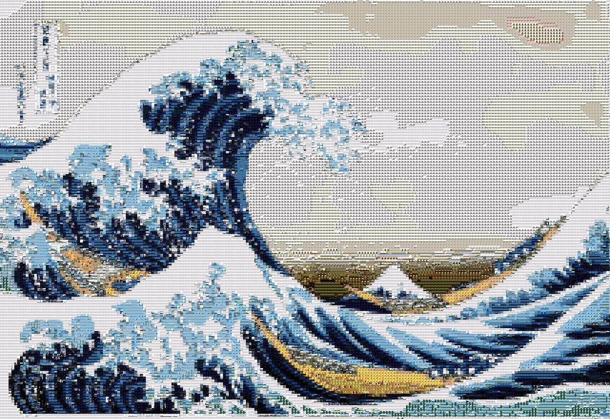
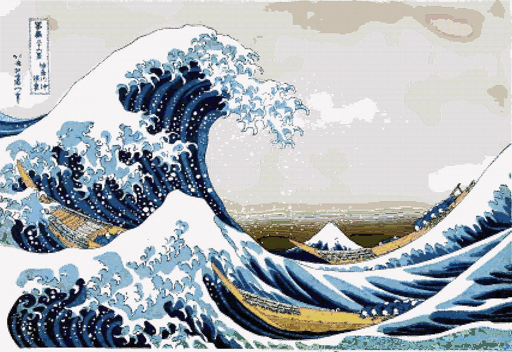

colourage
=========

python image analyser gets colours then builds collage by doing an image search based on those colours to build a collage

written in python, uses sqlite to store an index of seed pictures, which it then generates a collage from, based on a supplied collage seed.

See sample pics below.

How to use

==========

1. put all your source seed pictures into the 'seed' folder. 

2. add a picture (in same folder as the py scripts) and call it 'colage_seed.jpg' (if it's called something else, update the variable in generate.py)

3. run db.py to create the sql db

4. run analyse.py (this will take some time, indexing every jpg image in the seed folder and storing the average rgb colour values)

5. finally, run generate.py

(only do steps 3 and 4 once, not each time you make a colage)

**Options:**

in generate.py, edit the variables 's_seed_image' and 'ia_step_sizes' to change the source image, and output resolution of the colage.

Then run the analyse.py script. It will loop through all pictures and store the average RGB values into an sqlite instance.

Once the index is complete run generate.py to build a collage from based on the seed image and indexed seed folder pictures.

You can edit the generate.py script to change the supplied seed (the picture you want a collage made for), and also the 'resolution'.

**TO DO**
- make multi threaded

Turn:

into:

